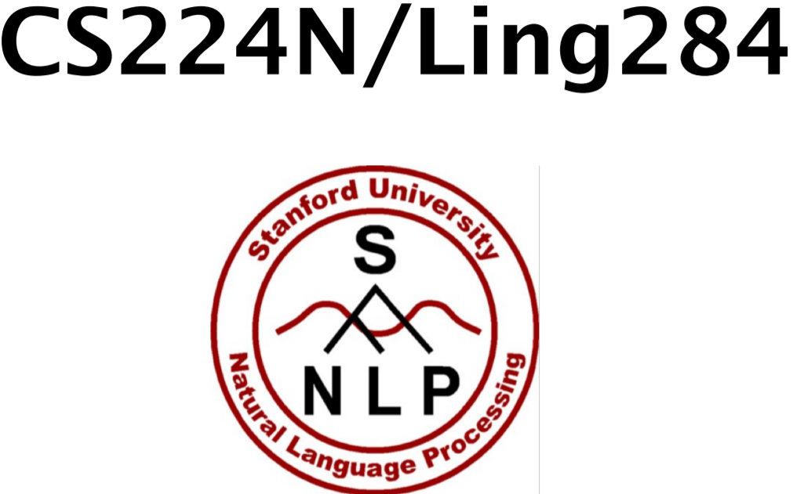

# CS224n-NLP

NLP Class from Stanford

http://web.stanford.edu/class/cs224n/index.html

## Lecture Videos
List of videos here:

https://www.youtube.com/playlist?list=PLoROMvodv4rOhcuXMZkNm7j3fVwBBY42z

## Slides original link
Slides mirror:

https://web.stanford.edu/class/cs224n/slides/

## Link to the newer class material
The assignments from our repos are newer than those mentioned in the lecture videos, and use Tensorflow instead of pyTorch:

https://web.stanford.edu/class/archive/cs/cs224n/cs224n.1184/syllabus.html